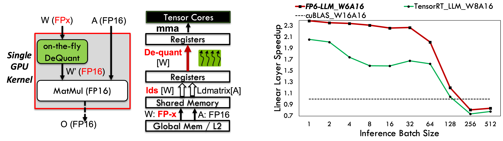
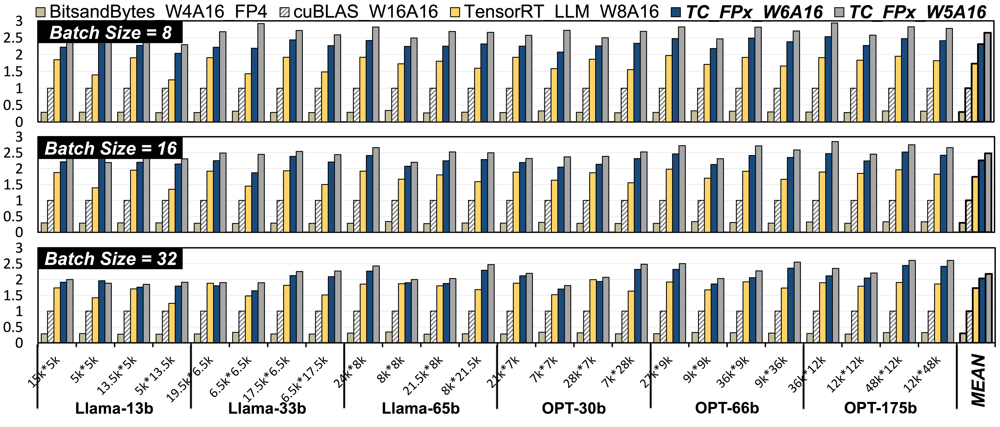
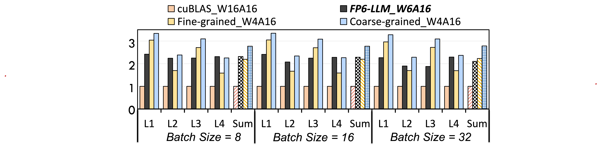
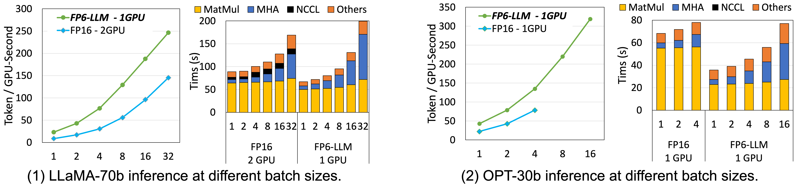
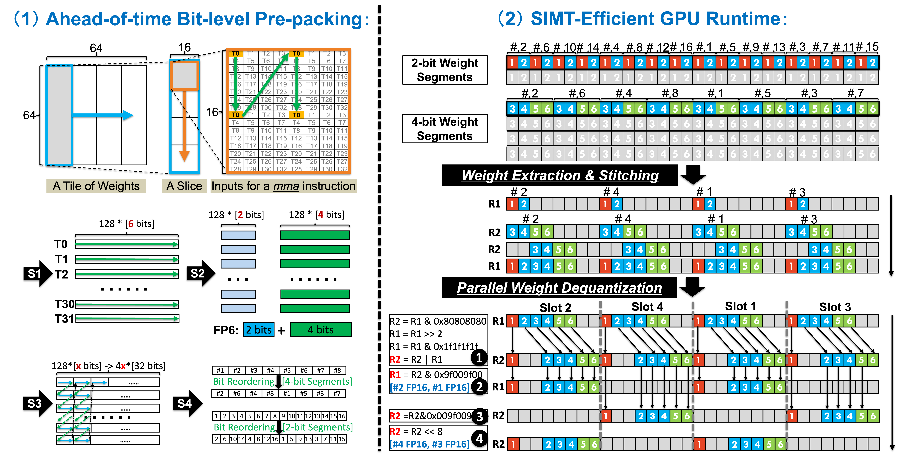

# FP6-LLM
Six-bit quantization (FP6) can achieve **better trade-offs** between [*model quality*](#1-model-accuracy) and [*inference cost*](#2-speedups-on-linear-layers) compard to 4-bit and 8-bit quantization counterparts, reducing the size of large language models (LLMs) effectively and preserving the model quality consistently across varied applications.
To support **6-bit inference of LLMs effective on modern GPUs**, we provide the official implementation of [**FP6-LLM**](https://arxiv.org/pdf/2401.14112.pdf), achieving significant *speedups of linear layers* and *GPU memory reduction* over the fp16/int8 baselines.

Our long-term goal is to support **various quantization methods** by providing **extensible & high-performance** GPU kernels for mixed-input matrix multiplication, using the **unified design scheme** presented in our [paper](https://arxiv.org/pdf/2401.14112.pdf).



## Roadmap

The current release contains:
- Efficient CUDA implementation for mixed-input matrix multiplication of linear layers (weights in FP6 and activations in FP16 format) with Tensor Core enabled.
- C++ APIs and PyTorch APIs to use the CUDA kernels.
- Test codes to demonstrate the usage of FP6-LLM and verify its correctness.

Our future plan includes but not limited to :
- [ ] **End-to-end inference** support of [LLaMA2](https://arxiv.org/abs/2307.09288) models will be released soon.
- [ ] Adding [StreamK](https://arxiv.org/abs/2301.03598) support for more flexible and efficient matrix-matrix multiplications.
- [ ] Optimizing the performance for *compute bound* cases.
- [ ] Currently, FP6-LLM only supports **FP6** quantization due to its accuracy/performance tradeoff benefits. However, the technology of FP6-LLM can be easily applied to other quanzation methods, e.g., **FP5, INT5 and INT6**.
- [ ] Currently, FP6-LLM is only tested and verified on **A100 GPUs**, but the core design methods can also be applied to other Tensor Core GPUs like **NVIDIA H100 and GH200**. Furtheremore, W6A8 quantization can be supported on H100 GPUs by exploiting the FP8 Tensor Cores.

## Installation
1. Clone this repository.
```sh
git clone https://github.com/usyd-fsalab/fp6_llm.git
cd fp6_llm
```
2. Install the python package. [Enabling PyTorch APIs]
```sh
pip install .
```

3. Compiling the .so file. [Enabling C++ APIs]
```sh
cd fp6_llm && make
```

## Tests
We provide scripts to verify the correctness of FP6-LLM.
The outputs of FP6-LLM are compared to the outputs of the FP16 baseliness (the official implementation of linear layer in PyTorch and NVIDIA cuBLAS).

#### 1. Run tests for PyTorch APIs
```
cd ../tests/python
./run.sh
```

#### 2. Run tests for C++ APIs
```
cd ../cpp
make
./run.sh
```

## How to use our CUDA kernels
We implemented the CUDA kernel supporting matrix multiply C = A × B, where A is the weight matrix of shape [OC, IC] in FP6 and B is the activation matrix of shape [IC, BS] in FP16.
C and B are column-major matrices.
The CUDA kernels can be launched via **PyTorch APIs** or **C++ APIs**.
Currently:
- OC(Output Channel) must be a multiple of 256, and IC(Input Channel) must be a multiple of 64.
- BS(Batch Size) can be arbitrary values, smaller BS is prefered for better performance than FP16 baseline.

For more details of using FP6-LLM APIs, please see the source code of the [C++/Python Test](#tests).

#### 1. PyTorch APIs
To use the PyTorch APIs of FP6-LLM, you only need to import the python module:
```
import fp6_llm
```

* Ahead of time weight prepacking:
```
fp6_pakced_weight = fp6_llm.weight_prepacking_cpu(fp6_weight)

Arguments:
    fp6_weight:         int tensor of shape [OC, IC // 16 * 3];     // 3 INT32 words contains 16 FP6 weights.
Return:
    fp6_pakced_weight:  int tensor of shape [OC, IC // 16 * 3];     // 3 INT32 words contains 16 FP6 weights.
```

* Execute FP6-FP16 mixed input GEMM on GPUs:
```
fp16_output=fp6_llm.linear_forward_cuda(fp6_packed_weight, fp16_scale, fp16_input, splitK)

Arguments:
    fp6_packed_weight:  int tensor of shape [OC, IC // 16 * 3];     // 3 INT32 words contains 16 FP6 weights.
    fp16_scale:         tensor of shape [OC];                       // half tensor
    fp16_input:         tensor of shape [B, IC];                    // half tensor
    splitK:             int value, spliting the MatMul problem along K dimension for higher GPU utilization, default 1.
Return:
    fp16_output:        tensor of shape [B, OC];                    // half tensor
```

* Dequantize an FP6 matrix back to FP16 matrix with CPUs (a useful tool to construct input matrices for the FP16 GEMM baseline):
```
fp16_tensor=fp6_llm.weight_dequant_cpu(fp6_tensor, fp16_scale)

Arguments:
    fp6_tensor:         int  tensor of shape [OC, IC // 16 * 3];   // 3 INT32 words contains 16 FP6  weights.
    fp16_scale:         half tensor of shape [OC];                 // for row-wise quantization.
Return:
    fp16_tensor:        half tensor of shape [OC, IC].
```

#### 2. C++ APIs
To use the C++ APIs of FP6-LLM, you need to include [this head file](fp6_llm/csrc/fp6_linear.cuh) of FP6-LLM in your C++ codes:
```
#include "fp6_linear.cuh"
```
Besides, you need to link the dynamic linkable library (*fp6.so*) under [this directory](fp6_llm/) during compilation.

* Ahead of time weight prepacking:
```
void weight_matrix_prepacking(int* packed_weights,                  // [Output] prepacked FP6 weight matrix
                              int *FP6Weights,                      // [Input]  original FP6 weight matrix
                              size_t M,                             // OC
                              size_t K);                            // IC
```

* Execute FP6-FP16 mixed input GEMM on GPUs:
```
cudaError_t fp6_linear_kernel(cudaStream_t    stream,               // CUDA stream to execute the GPU kernel.
                              const uint4     *Weight,              // [Input]  Pointer to the FP6 weight matrix.
                              const half      *Scales,              // [Input]  Pointer to the FP16 quantization scales.
                              const half      *B,                   // [Input]  Pointer to the FP16 input activation.
                              half            *C,                   // [Output] Pointer to the FP16 output activation.
                              const size_t    M_Global,             // OC
                              const size_t    N_Global,             // BS
                              const size_t    K_Global,             // IC
                              float           *Reduction_Workspace, // Pointer to the temporary workspace for splitK reduction. Workspace_Size = Split_K * M_Global * N_Global * sizeof(fp32)
                              int             Split_K);             // splitK
```

* Dequantize an FP6 matrix back to FP16 matrix with CPUs
```
void DeQuantMatrix_FP6_To_FP16(half* A_16bit_h,                     // [Output] Pointer to the dequantized FP16 weight. matrix.
                               unsigned char* A_6bit_h,             // [Input]  Pointer to the quantized FP6 weight matrix. 
                               size_t M,                            // OC
                               size_t K,                            // IC
                               half* scale);                        // [Input]  Pointer to the FP16 quantization scales.
```

## Performance

#### 1. Model Accuracy
> **FP6 quantization is a practical alternative to further democratize the deployment of LLMs without significantly sacrificing model quality on complex tasks and various model sizes.**

- While 4-bit quantization unavoidably causes degradation in model quality, near-lossless model compression can be achieved with 6-bit quantization. As shown in Table 1 and Table 2, FP6 displays **strong and consistent performance across various tasks** including code generation and zero-shot perplexity performance.
- It also shows **high robustness across various model sizes**, e.g., 1B, 13B, and 65B LLaMA models. 
- FP6 quantization already works well on coarse-grained quantization, while INT4 quantization heavily relies on Fine-Grained Quantization (FGQ) methods to maintain high model quality.
- *More details can be found in these two papers ([FP6-LLM](https://arxiv.org/pdf/2401.14112.pdf) & [ZeroQuant(4+2)](https://arxiv.org/abs/2312.08583)).*


#### 2. Speedups on linear layers

> **Compared to the FP16 baselines (cuBLAS), INT8 quantization (TensorRT_LLM),
and FP4 quantization (bitsandbytes):**

- FP6-LLM outperforms bitsandbytes, cuBLAS, and TensorRT_LLM by **up to** 8.9×, 2.6×, and 1.9×. 
- FP6-LLM outperforms bitsandbytes, cuBLAS and TensorRT_LLM by 7.2×, 2.1×, and 1.3× **on average**.



> **Compared to baselines for INT4 quantization (TensorRT_LLM):**

- FP6-LLM is **1.06×/1.04×/0.94× faster** than **Fine-grained_W4A16** at batch size 8/16/32, espectively. 
- FP6-LLM is **only 16%/17%/24% slower** than **Coarse-grained_W4A16** at batch size 8/16/32. 
- It is **a worthwhile trade-off** between model quality and inference speed, since FP6 quantization can provide [higher model quality](#1-model-accuracy) than INT4 quantization. 



#### 3. Speedups on end-to-end inference

> **Experimental settings and baselines:**

- We integrate our FP6-LLM kernel into DeepSpeed for end-to-end evaluation. The baseline for comparison is the FP16 execution of the original DeepSpeed inference system.
- We set the prefill/prompt length of each request to 0.5K, and generate 1.5K tokens for each request ignoring the "EOS" (end of sequence) token. 




> **Results of LLaMA-70b:**
- Both FP6-LLM and FP16 baseline can at most set the inference **batch size to 32** before running out of GPU memory, whereas **FP6-LLM** only requires **a single GPU** and the **baseline** uses **two GPUs**. 
- FP6-LLM achieves **1.69×-2.65× higher normalized inference throughput** than the FP16 baseline.

> **Results of OPT-30b:**
- FP6-LLM can set the inference batch size at most to 16 before running out of GPU memory while the FP16 baseline can at most serve 4 requests in a batch. 
- Using a 80GB A100 GPU, FP6-LLM/FP16-baseline can at most achieve 319.1/78.8 tokens per GPU-second with batch size 16/4.
- FP6-LLM achieves 1.91×/1.84×/1.72× higher generation throughput compared to the FP16 baseline when their batch sizes are set to 1/2/4.

> **Inference latency breakdown of LLaMA-70b:**
- The execution of linear layers (MatMul) implemented with FP6-LLM is 1.20× faster than the FP16 baseline on average, even with half number of GPUs.
- The FP16 baseline is faster running multi-head attention (MHA) with 2-way tensor parallelism.
- Cross-GPU communications (NCCL) is avoided using FP6-LLM since only a
single GPU is required. 

> **Inference latency breakdown of OPT-30b:**
- End-to-end performance improvements mainly comes from time reduction in executing linear layers.
- The linear layers implemented with FP6-LLM are 2.39× faster than the FP16 baselines on average.


## Key Innovations
> We propose **TC-FPx**, **the first full-stack GPU system design scheme with unified Tensor Core support of float-point weights for various quantization bit-width (6-bit, 5-bit, 3-bit, etc.), mitigating the "memory wall" issues during LLM inference.**
TC-FPx breaks the limitations of the underlying GPU hardware, allowing the GPU to support linear layer calculations involving model weights of arbitrary bit width. 
In TC-FPx, Tensor Cores are utilized for intensive computation of matrix multiplications,
while SIMT cores are effectively leveraged for weight dequantization, transforming the x-bit model weights to FP16 type during runtime before feeding them to Tensor Cores. 

- We propose **Ahead-of-time Bit-level Pre-packing** to resolve the challenge of unfriendly memory access for weights with irregular bit-width, enabling optimal GPU memory access.
- Besides, we propose **SIMT-Efficient GPU Runtime** to minimize the runtime overhead of weight de-quantization. 
- Last but not least, we present the software pipeline of TC-FPx kernel, where SIMT cores, Tensor Cores, and the GPU memory hierarchy cooperate efficiently with high performance.



## FP6-LLM Community
FP6-LLM is already integrated in [DeepSpeed](https://github.com/microsoft/DeepSpeed) and this new feature will be available soon.
Given that easy-to-use PyTorch and C++ APIs are provided, FP6-LLM can be easily integrated to any inference frameworks as an useful component.
We welcome collaborations to integrate FP6-LLM into other inference frameworks.
We also welcome all AI developers/practitioners/researchers to join this on-going project, fully exploring the potential of different quantization methods.

## Citation

If you find FP6-LLM useful or relevant to your research, please kindly cite [our paper](https://arxiv.org/pdf/2401.14112.pdf):

```
@misc{xia2024fp6llm,
      title={FP6-LLM: Efficiently Serving Large Language Models Through FP6-Centric Algorithm-System Co-Design}, 
      author={Haojun Xia and Zhen Zheng and Xiaoxia Wu and Shiyang Chen and Zhewei Yao and Stephen Youn and Arash Bakhtiari and Michael Wyatt and Donglin Zhuang and Zhongzhu Zhou and Olatunji Ruwase and Yuxiong He and Shuaiwen Leon Song},
      year={2024},
      eprint={2401.14112},
      archivePrefix={arXiv},
      primaryClass={cs.LG}
}
```

## Change Logs
- **[4th March, 2024]**: Release of FP6-LLM v1.0.

## Related Projects
- [ZeroQuant(4+2): Redefining LLMs Quantization with a New FP6-Centric Strategy for Diverse Generative Tasks](https://arxiv.org/abs/2312.08583)
- [DeepSpeed: Extreme Speed and Scale for DL Training and Inference](https://github.com/microsoft/DeepSpeed)
- [cuBLAS: Basic Linear Algebra on NVIDIA GPUs](https://developer.nvidia.com/cublas)
- [TensorRT-LLM: A TensorRT Toolbox for Optimized Large Language Model Inference](https://github.com/NVIDIA/TensorRT-LLM)
- [bitsandbytes: the library including quantization primitives for 8-bit & 4-bit operations](https://github.com/TimDettmers/bitsandbytes)
- [Mixed-input matrix multiplication performance optimizations](https://blog.research.google/2024/01/mixed-input-matrix-multiplication.html)
- [Flash-LLM: Enabling Cost-Effective and Highly-Efficient Large Generative Model Inference with Unstructured Sparsity](https://www.vldb.org/pvldb/vol17/p211-xia.pdf)
